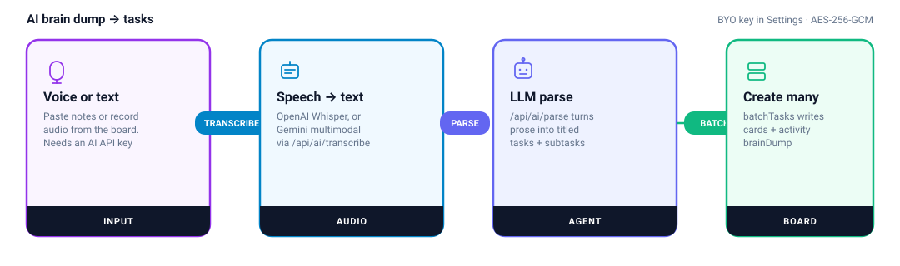

# AI

AI is **bring your own key**. Credentials live on `UserSettings` (provider, encrypted API key, optional model and base URL, voice language). Nothing is billed through Kikiboard.

## Credentials

`/dashboard/settings` → `/api/settings/ai`.

The key is stored AES-256-GCM (`lib/crypto.ts`). `getUserAiCredentials` decrypts it for the three AI routes. Missing key → 400 telling the user to open Settings.

Providers in `UserSettings.aiProvider`: `openai`, `claude`, `gemini`, `grok`, `deepseek`, `kimi`, `custom`.

`lib/ai/engine.ts` routes:

- Claude → Anthropic messages API
- Gemini → `generateContent` with JSON mime type
- Everyone else → OpenAI-compatible `/v1/chat/completions` (OpenAI, xAI, DeepSeek, Kimi, custom base URL)

## Transcribe

`POST /api/ai/transcribe` (multipart `file` + `language`)

- OpenAI / custom → Whisper `whisper-1`
- Gemini → multimodal `gemini-1.5-flash`
- Returns `{ text }`

The UI `VoiceInput` component records in the browser and posts here.

## Parse (brain dump)

`POST /api/ai/parse` `{ text }`

`parseBrainDump` asks the model (see `lib/ai/prompts.ts`) for a JSON list of tasks: title, description, priority, dates, subtasks, target list.

The client then sends that list to `POST /api/boards/[boardId]/batchTasks`, which inserts cards and logs `activity.brainDump`.

## Improve a card

`POST /api/ai/improve` `{ title, description }`

`improveTask` rewrites copy; the client patches the task if the user accepts.

## MCP

`mcp/server.ts` is a Model Context Protocol server for Claude Desktop / Cursor / similar. It calls the same HTTP APIs:

| Tool | Does |
|---|---|
| `list_boards` | Boards, lists, task counts |
| `list_tasks` | Filter by board, status, priority, quarter, archive |
| `create_task` | One card |
| `update_task` | Fields + completion |
| `parse_and_create_tasks` | Brain dump then batch create |
| `bulk_archive_tasks` | Archive completed / old-quarter work |
| `list_epics` | Epic progress |

Env: `KIKIBOARD_API_URL` (see `mcp/README.md`). The server has **no Clerk cookies**, so those tools 401 against a protected local app unless something else injects a session. `list_tasks` is documented as calling `GET /api/tasks`, which does not exist as a route.
