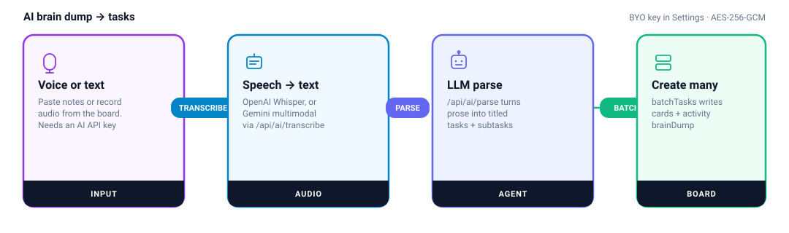

# AI

AI is **bring your own key**. Credentials live on `UserSettings` (provider, encrypted API key, optional model and base URL, voice language). Nothing is billed through Kikiboard.

## Credentials

`/dashboard/settings` → `/api/settings/ai`.

The key is stored AES-256-GCM (`lib/crypto.ts`). `getUserAiCredentials` decrypts it for the three AI routes. Missing key → 400 telling the user to open Settings.

Providers in `UserSettings.aiProvider`: `openai`, `claude`, `gemini`, `grok`, `deepseek`, `kimi`, `custom`.

`lib/ai/engine.ts` routes:

- Claude → Anthropic messages API
- Gemini → `generateContent` with JSON mime type
- Everyone else → OpenAI-compatible `/v1/chat/completions` (OpenAI, xAI, DeepSeek, Kimi, custom base URL)

## Transcribe

`POST /api/ai/transcribe` (multipart `file` + `language`)

- OpenAI / custom → Whisper `whisper-1`
- Gemini → multimodal `gemini-1.5-flash`
- Returns `{ text }`

The UI `VoiceInput` component records in the browser and posts here.

## Parse (brain dump)

`POST /api/ai/parse` `{ text }`

`parseBrainDump` asks the model (see `lib/ai/prompts.ts`) for a JSON list of tasks: title, description, priority, dates, subtasks, target list.

The client then sends that list to `POST /api/boards/[boardId]/batchTasks`, which inserts cards and logs `activity.brainDump`.

## Improve a card

`POST /api/ai/improve` `{ title, description }`

`improveTask` rewrites copy; the client patches the task if the user accepts.

## MCP

`POST /api/mcp` is a stateless Streamable HTTP MCP endpoint for ChatGPT,
Claude, and other MCP-capable clients. It uses a bearer credential created by a
board owner or admin at `/api/boards/{boardId}/external-access`.

Every credential is pinned to one board and has an environment allowlist. MCP
tools never accept a board id: `get_project`, `list_tickets`, and `get_ticket`
derive it from the credential. A restricted credential only returns tickets
whose default `environment` custom field has an allowed value; unclassified
tickets are denied. `*` explicitly grants all environments, including
unclassified tickets.

Credentials currently expose only the `tickets:read` scope. Plaintext tokens
are returned once, while only their SHA-256 hashes are stored. They can expire
and can be revoked; use and revocation timestamps are retained for audit.

The old `mcp/server.ts` stdio proxy is legacy and should not be used for new
connections because it relies on Clerk-protected browser endpoints. See
`mcp/README.md` for provisioning and connection examples.
