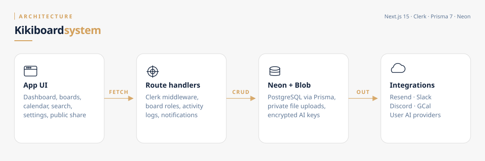
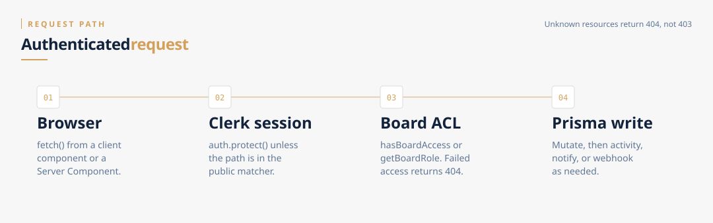
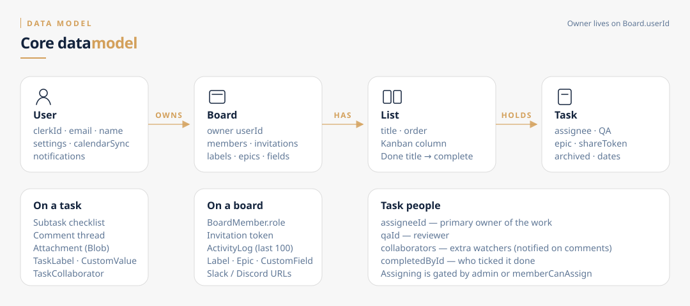

# Architecture

Kikiboard is a Next.js 16 App Router app. The browser talks to Route Handlers under `app/api`. Those handlers resolve the Clerk user to a Neon `User`, check board access, then mutate Prisma models. Outbound calls (email, chat webhooks, calendar, LLM providers) happen after the write.

## Stack

| Layer | Choice |
|---|---|
| UI | Next.js 16 App Router, Tailwind v4, shadcn/ui, Zustand, dnd-kit, Tiptap |
| Auth | Clerk (`clerkMiddleware` + `auth.protect`) |
| Data | Prisma 7 → PostgreSQL on Neon |
| Files | Vercel Blob (`access: "private"`) |
| Email | Resend |
| Deploy | Vercel |

## Request path

Almost every mutating API follows the same sequence.

1. **Clerk session.** `middleware.ts` protects everything except the public matcher (`/`, `/sign-in`, `/sign-up`, `/functions`, `/stats`, `/privacy`, `/share/task`, `/api/webhooks`, Google Calendar callback).
2. **App user.** Handlers call `auth()`, then `db.user.findUnique({ clerkId })` or `getOrCreateUser`.
3. **Board ACL.** `hasBoardAccess` (owner **or** `BoardMember`) or `getBoardRole` for finer checks. Failed access is usually **404**, not 403, so callers cannot probe board ids.
4. **Write + side effects.** Prisma mutation, then `createActivity`, `notification.create`, and (on complete) Slack/Discord.

## Data model

Ownership is **not** a `BoardMember` row. `Board.userId` is the owner. Members live in `BoardMember` with `role` `"admin"` or `"member"`. Unknown stored roles normalize to `"member"`.

A task belongs to exactly one `List` on one `Board`. People on a task:

- `assigneeId` — owner of the work
- `qaId` — reviewer
- `TaskCollaborator` — extra watchers (comment notifications)

## App surfaces after sign-in

- **Dashboard** — greeting, weekly activity, assigned work, upcoming due dates, recent boards.
- **Board** — Kanban or list, live-ish polling (`use-board-polling`), activity drawer.
- **Calendar** — `/api/calendar` tasks with due dates.
- **My tasks** — `/dashboard/tasks`.
- **Settings** — per-user AI credentials, custom fields, Google Calendar OAuth.
- **Cmd+K search** — `/api/search` over boards and tasks the user can see.
