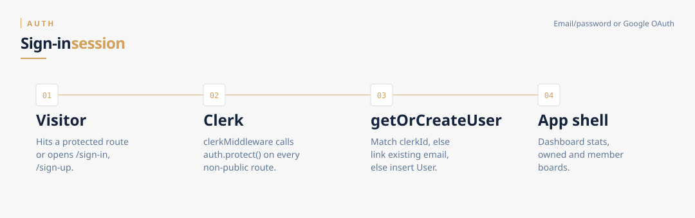
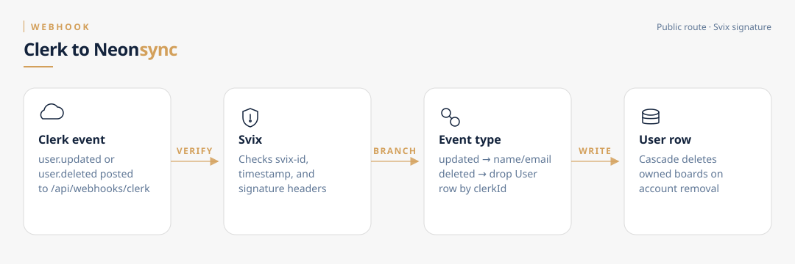

# Auth and identity

Identity has two stores: **Clerk** (session, OAuth, password) and **Neon `User`** (app data). They stay in sync on first use and via webhooks.

## Sign-in

1. Public pages (`/`, marketing, share links) skip `auth.protect()`.
2. Any other route — including `/dashboard` and `/api/*` — requires a Clerk session. Unauthenticated users are sent to `/sign-in`.
3. Supported methods: email/password and Google OAuth (Clerk).
4. The first dashboard load calls `getOrCreateUser(clerkId)`:

   - User already has this `clerkId` → reuse.
   - Same **email** exists (password account later used Google, or the reverse) → attach `clerkId` to that row instead of duplicating.
   - Otherwise insert `User { clerkId, email, name }`.

`/sign-in` and `/sign-up` live under `app/(auth)/` and use Clerk's catch-all components.

## Public vs protected

Defined in `middleware.ts`:

| Public | Protected |
|---|---|
| `/`, `/functions`, `/stats`, `/privacy` | `/dashboard/*`, `/board/*` |
| `/sign-in`, `/sign-up` | `/invite/[token]` (not public — Clerk forces sign-in first) |
| `/share/task/*` | All `/api/*` except webhooks and GCal callback |
| `/api/webhooks/*` | |
| `/api/integrations/google-calendar/callback` | |

## Clerk → Neon webhook

`POST /api/webhooks/clerk` is public but **Svix-signed**. Missing headers or a bad signature → 400.

| Event | Effect |
|---|---|
| `user.updated` | `updateMany` name + email on the row with that `clerkId` |
| `user.deleted` | `deleteMany` by `clerkId`. Prisma `onDelete: Cascade` removes owned boards |

This is how a Clerk account deletion wipes the corresponding Kikiboard user.

## Code

- `middleware.ts` — route matcher
- `lib/getOrCreateUser.ts` — first-touch sync + email linking
- `app/api/webhooks/clerk/route.ts` — Svix verify + update/delete
