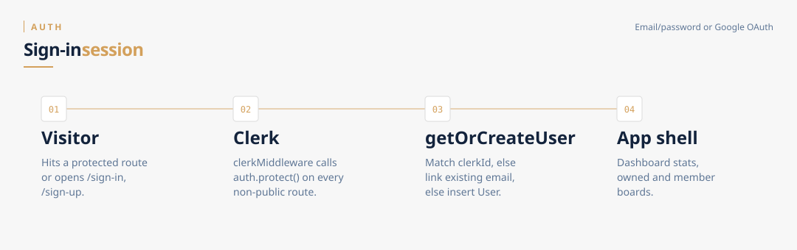
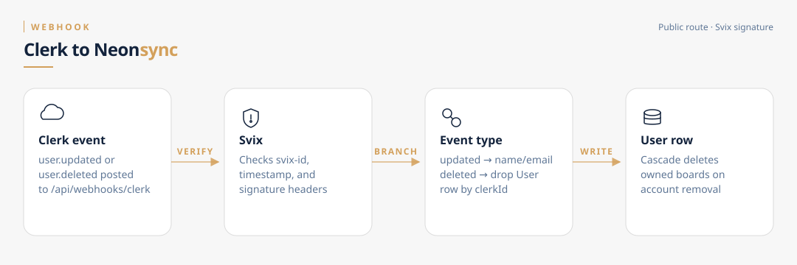

# Auth and identity

Identity has two stores: **Clerk** (session, OAuth, password) and **Neon `User`** (app data). They stay in sync on first use and via webhooks.

## Sign-in

1. Public pages (`/`, marketing, share links) skip `auth.protect()`.
2. Any other route — including `/dashboard` and `/api/*` — requires a Clerk session. Unauthenticated users are sent to `/sign-in`.
3. Supported methods: email/password and Google OAuth (Clerk).
4. The first dashboard load calls `getOrCreateUser(clerkId)`:

   - User already has this `clerkId` → reuse.
   - Same **email** exists (password account later used Google, or the reverse) → attach `clerkId` to that row instead of duplicating.
   - Otherwise insert `User { clerkId, email, name }`.

`/sign-in` and `/sign-up` live under `app/(auth)/` and use Clerk's catch-all components.

## Public vs protected

Defined in `middleware.ts`:

MCP routes `/api/mcp(.*)` and the two OAuth well-known discovery endpoints are
public to Clerk. MCP enforces bearer authentication itself. OAuth authorization
redirects to `/dashboard/mcp-authorize`, which requires a Clerk session; its
consent action checks current board/organization admin access. Token exchanges
require user-created or legacy predefined confidential client credentials and S256 PKCE for codes.
See `mcp/README.md` for configuration and token lifetimes.

| Public | Protected |
|---|---|
| `/`, `/functions`, `/stats`, `/privacy` | `/dashboard/*`, `/board/*` |
| `/sign-in`, `/sign-up` | `/invite/[token]` (not public — Clerk forces sign-in first) |
| `/share/task/*` | All `/api/*` except webhooks and GCal callback |
| `/api/webhooks/*` | |
| `/api/integrations/google-calendar/callback` | |

## Clerk → Neon webhook

`POST /api/webhooks/clerk` is public but **Svix-signed**. Missing headers or a bad signature → 400.

| Event | Effect |
|---|---|
| `user.updated` | `updateMany` name + email on the row with that `clerkId` |
| `user.deleted` | `deleteMany` by `clerkId`. Prisma `onDelete: Cascade` removes owned boards |

This is how a Clerk account deletion wipes the corresponding Kikiboard user.

## Code

- `middleware.ts` — route matcher
- `lib/getOrCreateUser.ts` — first-touch sync + email linking
- `app/api/webhooks/clerk/route.ts` — Svix verify + update/delete

Users generate account-owned ChatGPT client credentials in Settings → MCP.
The callback is allowlisted exactly, the secret is shown once and stored only
as a hash, and client revocation invalidates its grants. The legacy deployment
client remains optional. See `mcp/README.md` for provider-specific guides.

### MCP task writes and history

MCP read/write credentials support task creation, edits, moves, completion and
archiving within their organization/board scope. The creator must still have
board edit permission. Read-only credentials remain unchanged. OAuth write
access is approved explicitly during consent. Each operation stores before/after
state in `McpChange` and board activity in the same serializable transaction;
completion sends the existing board webhooks after commit. Settings → MCP
provides administrator-only history preview and confirmed revert, independently
of whether the original credential remains active. Reverts reject later edits
and missing original lists, and undo creation by archiving. Sent integration
messages are not recalled. See `mcp/README.md` for scope and supported fields.
