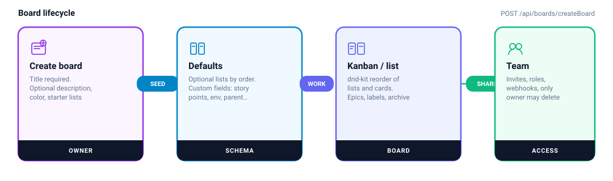
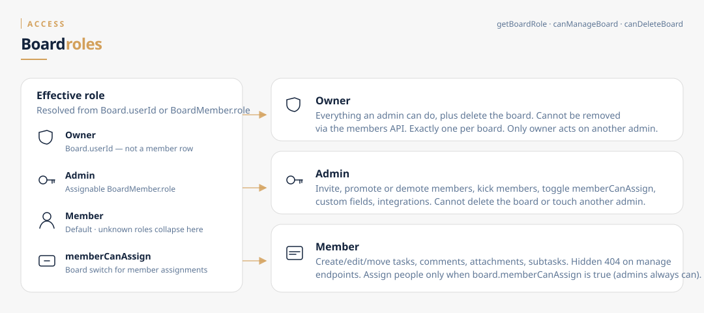

# Boards and roles

A board is the workspace: lists (columns), tasks, labels, epics, custom fields, members, and activity. Creating one makes you the **owner**.

## Create

`POST /api/boards/createBoard`

1. Clerk session → `getOrCreateUser`.
2. Title is required. Description, color, and an optional `lists: string[]` are stored.
3. Prisma creates the board with `userId = current user` (this is the owner).
4. Starter lists, if any, get `order` 0..n.
5. Default custom fields are always seeded: story points, environment, parent, child, customer (`lib/customFieldsDefaults.ts`).

`GET /api/boards/getBoards` returns boards where the user is owner **or** a `BoardMember`.

Rename: `PATCH /api/boards/updateBoard/[boardId]` — **owner only** (admins get 404).
Delete: `DELETE /api/boards/deleteBoard/[boardId]` — **owner only**. Cascade removes lists, tasks, members, invitations, labels, epics, fields, activity.

The board header may still show rename/delete to other members; the API rejects them.

## Lists

| Action | Route |
|---|---|
| Create | `POST /api/lists/createList` |
| Rename | `PATCH /api/lists/updateList/[listId]` |
| Delete | `DELETE /api/lists/deleteList/[listId]` |
| Reorder | `PATCH /api/lists/updateOrder` |

List titles matter for status: a name containing `done`, `hecho`, `completad`, or `finaliz` is treated as a **Done** column (`lib/statusTheme.ts`). Moving a card there via `updateTask` marks it completed.

Deleting a list is **admin/owner** (`403` for members) and cascades every task on it.

Views on `/board/[boardId]`: Kanban (dnd-kit) and a list toggle.

## Roles

| Role | Stored as | Can |
|---|---|---|
| **Owner** | `Board.userId` (no member row) | All admin actions + delete board + remove admins |
| **Admin** | `BoardMember.role = "admin"` | Invites, roles, `memberCanAssign`, custom fields, integrations. Cannot delete/rename the board, revoke invitations, or kick another admin |
| **Member** | `BoardMember.role = "member"` (default) | Work on tasks. Assign people only if `board.memberCanAssign` |

`getBoardRole` in `lib/boardAccess.ts` is the source of truth. Manage endpoints that fail ACL return **404** so members cannot enumerate invitations or members they should not see.

`PATCH /api/boards/[boardId]/permissions` (admin/owner) sets `memberCanAssign`.

`PATCH` / `DELETE /api/boards/[boardId]/members/[memberId]` change or remove a member. Only the owner can delete an admin.

## API permission cheat sheet

| Capability | Owner | Admin | Member |
|---|---|---|---|
| Create/edit/move tasks, labels, comments, files, subtasks, epics, archive tasks | ✓ | ✓ | ✓ |
| Delete a list | ✓ | ✓ | ✗ |
| Invite | ✓ | ✓ | ✗ |
| Revoke invitation | ✓ | ✗ | ✗ |
| Change role / remove member | ✓ | ✓ (not other admins) | ✗ |
| Integrations PATCH, custom fields, `memberCanAssign` | ✓ | ✓ | ✗ |
| Rename/delete board, PUT board links | ✓ | ✗ | ✗ |
| Assign / QA / collaborators (dedicated routes) | ✓ | ✓ | only if `memberCanAssign` |
| Delete someone else’s comment | ✓ | ✓ | author only |

Some header controls are shown more broadly than the API allows (rename/delete board, invite form). Trust the table above, not the button visibility.

## Related board APIs

- Labels: `/api/labels/[boardId]`, `/api/labels/label/[labelId]`
- Epics: `/api/boards/[boardId]/epics`
- Activity: `/api/boards/[boardId]/activity` (last 100)
- Archive: `/api/boards/[boardId]/archive`
- Integrations URLs: `/api/boards/[boardId]/integrations`
- Custom fields: `/api/settings/custom-fields*`
