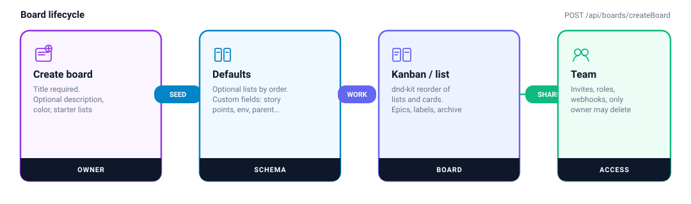
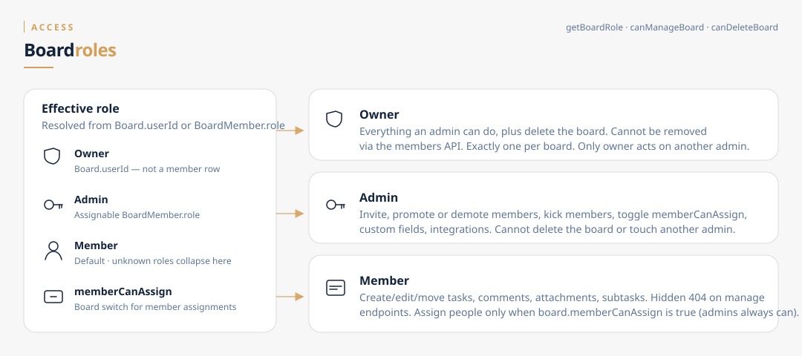

# Boards and roles

A board is the workspace: lists (columns), tasks, labels, epics, custom fields, members, and activity. Creating one makes you the **owner**.

## Create

`POST /api/boards/createBoard`

1. Clerk session → `getOrCreateUser`.
2. Title is required. Description, color, and an optional `lists: string[]` are stored.
3. Prisma creates the board with `userId = current user` (this is the owner).
4. Starter lists, if any, get `order` 0..n.
5. Default custom fields are always seeded: story points, environment, parent, child, customer (`lib/customFieldsDefaults.ts`).

`GET /api/boards/getBoards` returns boards the user can read: boards they own, boards where they have a direct membership, boards granted to one of their teams, and organization-mode boards in an organization they belong to. Organization owners and admins can also read restricted boards in their organization.

Rename: `PATCH /api/boards/updateBoard/[boardId]` — **owner only** (admins get 404).
Delete: `DELETE /api/boards/deleteBoard/[boardId]` — **owner only**. Cascade removes lists, tasks, members, invitations, labels, epics, fields, activity.

The board header may still show rename/delete to other members; the API rejects them.

## Lists

| Action | Route |
|---|---|
| Create | `POST /api/lists/createList` |
| Rename | `PATCH /api/lists/updateList/[listId]` |
| Delete | `DELETE /api/lists/deleteList/[listId]` |
| Reorder | `PATCH /api/lists/updateOrder` |

List titles matter for status: a name containing `done`, `hecho`, `completad`, or `finaliz` is treated as a **Done** column (`lib/statusTheme.ts`). Moving a card there via `updateTask` marks it completed.

Deleting a list is **admin/owner** (`403` for members) and cascades every task on it.

Views on `/board/[boardId]`: Kanban (dnd-kit) and a list toggle.

## Roles

| Role | Stored as | Can |
|---|---|---|
| **Owner** | `Board.userId` (no member row) | All admin actions + delete board + remove admins |
| **Admin** | `BoardMember.role = "admin"` | Invites, roles, `memberCanAssign`, custom fields, integrations. Cannot delete/rename the board, revoke invitations, or touch another admin (neither demote nor kick) |
| **Member** | `BoardMember.role = "member"` (default) | Work on tasks. Assign people only if `board.memberCanAssign` |
| **Viewer** | `BoardMember.role = "viewer"`, a team grant, or the board default | Read the board and its tickets. Cannot create, edit, move, or comment |

## Organizations

A board belongs to one organization. New boards are created in organization mode: every organization member can open them at `defaultRole` (`member` by default, or `viewer` when the board should be read-only for the organization).

The dashboard exposes `/dashboard/organizations` for creating organizations and viewing the organization → board hierarchy. Organization owners and admins can add existing users by email, create teams, and add organization members to teams. The board creation dialog lets managers choose the organization that owns a new board.

Board owners can transfer a board to another organization they manage. The Organizations page requires two UI steps (destination/impact review, then typed confirmation), and `PATCH /api/boards/[boardId]/organization` independently enforces the exact `MOVE <board title>` confirmation. A transfer removes source-organization team grants, preserves direct board members, removes organization-derived access from the source, and applies the board's access policy to the destination organization.

`accessMode: "restricted"` turns that off. The board then stays with its owner, its direct members, and any team grants. Organization owners and admins still have admin access on every board in the organization, including restricted ones. That is the organization-level permission. Team grants (`viewer`, `member`, or `admin`) are how a team gets read or edit access without opening the board to the whole organization.

Board admins set this from the board permissions dialog: everyone in the organization or only direct members and selected teams, the organization default of viewer or member, and a role for each team. Organization owners and admins create teams from the Organizations page. `GET` and `PATCH /api/boards/[boardId]/access` read and save the policy. `POST /api/organizations/[organizationId]/teams` creates a team and rejects a duplicate name in that organization.

Accepting a board invitation also adds the person to that board's organization. Removing a direct board member does not remove organization or team access. `DELETE /api/boards/[boardId]/members/[memberId]` returns `remainingRole` when one of those grants still applies. Removing someone from the organization is `DELETE /api/organizations/[organizationId]/members`.

`getBoardRole` in `lib/boardAccess.ts` is the source of truth. `canReadBoard` and `canEditBoard` are the checks routes use. Manage endpoints that fail ACL return **404** so members cannot enumerate invitations or members they should not see.

`PATCH /api/boards/[boardId]/permissions` (admin/owner) sets `memberCanAssign`.

`PATCH` / `DELETE /api/boards/[boardId]/members/[memberId]` change or remove a member. Both refuse when the caller is an admin and the target is an admin (`403`) — only the owner acts on admins. `PATCH` enforces this too, otherwise the `DELETE` guard could be walked around by demoting the other admin first.

## API permission cheat sheet

| Capability | Owner | Admin | Member |
|---|---|---|---|
| Create/edit/move tasks, labels, comments, files, subtasks, epics, archive tasks | ✓ | ✓ | ✓ |
| Delete a list | ✓ | ✓ | ✗ |
| Invite | ✓ | ✓ | ✗ |
| Revoke invitation | ✓ | ✗ | ✗ |
| Change role / remove member | ✓ | ✓ (not other admins) | ✗ |
| Integrations PATCH, custom fields, `memberCanAssign` | ✓ | ✓ | ✗ |
| Rename/delete board, PUT board links | ✓ | ✗ | ✗ |
| Assign / QA / collaborators (dedicated routes) | ✓ | ✓ | only if `memberCanAssign` |
| Delete someone else’s comment | ✓ | ✓ | author only |

The members dialog matches this table: the invite form and the role selector appear for admins, the role selector and the remove button are hidden on other admins, and revoking an invitation is owner-only. The board header matches the table for rename and delete: those actions are owner-only. Permissions and webhooks are shown to admins. Viewers can open the board and its tickets, and the ticket controls that write are hidden or disabled.

## Related board APIs

- Labels: `/api/labels/[boardId]`, `/api/labels/label/[labelId]`
- Epics: `/api/boards/[boardId]/epics`
- Activity: `/api/boards/[boardId]/activity` (last 100)
- Archive: `/api/boards/[boardId]/archive`
- Integrations URLs: `/api/boards/[boardId]/integrations`
- Custom fields: `/api/settings/custom-fields*`
