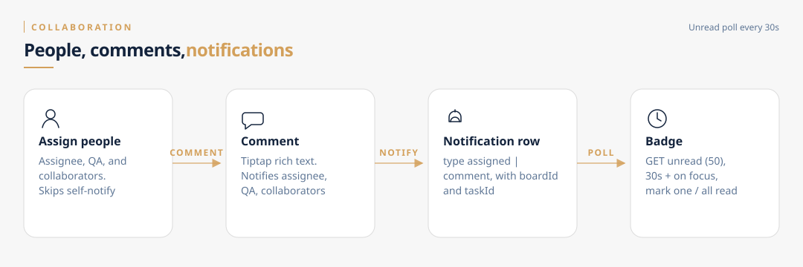

# Collaboration

People on a card (assignee, QA, collaborators) plus comments drive the in-app inbox. Board-wide history is a separate activity log.

## Assign

`POST /api/tasks/[taskId]/assignee` `{ assigneeId }`

- Admins/owners can always assign.
- Members only if `board.memberCanAssign`.
- Clicking the current assignee **clears** them (toggle).
- If the new assignee is not the actor → `Notification { type: "assigned" }`.
- Activity `task_assigned` or `task_unassigned`.

QA (`/qa`) and collaborators (`/collaborators`) follow the same notify-if-not-self pattern.

## Comments

`POST /api/tasks/[taskId]/comments`

1. Board access required.
2. Collect unique ids: assignee, QA, each collaborator, minus the commenter.
3. Transaction: insert `Comment` + `notification.createMany` with `type: "comment"`.
4. Messages are i18n keys encoded by `encodeLogMessage` (same helper as activity).

GET returns the thread with author name/email, oldest first.

## Notifications

`GET /api/notifications` — unread, newest first, max 50.

`PATCH /api/notifications` — mark all read.

`PATCH /api/notifications/[id]` — mark one read.

The bell polls about every **30 seconds** (skips a hidden tab) and again on focus. The board page separately polls with `useBoardPolling` (~25s) via `router.refresh`.

| `Notification.type` | Created when |
|---|---|
| `assigned` | Assignee set (not self) |
| `qa_assigned` | QA set (not self) |
| `collaborator_added` | Collaborator added (not self) |
| `comment` | Comment, to assignee / QA / collaborators |

Rows store `boardId` and `taskId` so the UI can deep-link.

## Activity log

`createActivity` writes `ActivityLog { type, message, boardId, userId }`. The board activity panel loads `/api/boards/[boardId]/activity` (capped at 100). Types include created, moved, completed, reopened, renamed, assigned, deleted, list changes, brain dump.

Activity is a board timeline. Notifications are personal.
