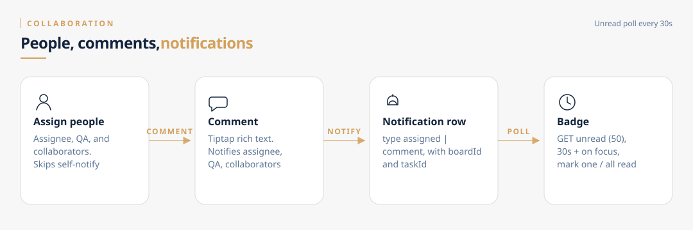

# Collaboration

People on a card (assignee, QA, collaborators) plus comments drive the in-app inbox. Board-wide history is a separate activity log.

## Assign

`POST /api/tasks/[taskId]/assignee` `{ assigneeId }`

- Admins/owners can always assign.
- Members only if `board.memberCanAssign`.
- Clicking the current assignee **clears** them (toggle).
- If the new assignee is not the actor → `Notification { type: "assigned" }`.
- Activity `task_assigned` or `task_unassigned`.

QA (`/qa`) and collaborators (`/collaborators`) follow the same notify-if-not-self pattern.

## Comments

`POST /api/tasks/[taskId]/comments`

1. Board access required.
2. Collect unique ids: assignee, QA, each collaborator, minus the commenter.
3. Transaction: insert `Comment` + `notification.createMany` with `type: "comment"`.
4. Messages are i18n keys encoded by `encodeLogMessage` (same helper as activity).

GET returns the thread with author name/email, oldest first.

## Notifications

`GET /api/notifications` — unread, newest first, max 50.

`PATCH /api/notifications` — mark all read.

`PATCH /api/notifications/[id]` — mark one read.

The bell polls about every **30 seconds** (skips a hidden tab) and again on focus. The board page separately polls with `useBoardPolling` (~25s) via `router.refresh`.

| `Notification.type` | Created when |
|---|---|
| `assigned` | Assignee set (not self) |
| `qa_assigned` | QA set (not self) |
| `collaborator_added` | Collaborator added (not self) |
| `comment` | Comment, to assignee / QA / collaborators |

Rows store `boardId` and `taskId` so the UI can deep-link.

## Activity log

`createActivity` writes `ActivityLog { type, message, boardId, userId }`. The board activity panel loads `/api/boards/[boardId]/activity` (capped at 100). Types include created, moved, completed, reopened, renamed, assigned, deleted, list changes, brain dump.

Activity is a board timeline. Notifications are personal.

### MCP task writes and history

MCP read/write credentials support task creation, edits, moves, completion and
archiving within their organization/board scope. The creator must still have
board edit permission. Read-only credentials remain unchanged. OAuth write
access is approved explicitly during consent. Each operation stores before/after
state in `McpChange` and board activity in the same serializable transaction;
completion sends the existing board webhooks after commit. Settings → MCP
provides administrator-only history preview and confirmed revert, independently
of whether the original credential remains active. Reverts reject later edits
and missing original lists, and undo creation by archiving. Sent integration
messages are not recalled. See `mcp/README.md` for scope and supported fields.

### Expanded MCP ticket contract

MCP reads now include assignee/QA identities, collaborators, checklist,
comments, attachment metadata, sharing and all custom-field definitions and
values. Project metadata supplies accessible people and field options. Ticket
listing supports assignee name/email, assignee/QA IDs and cursor pagination.
Writable credentials can edit every user-editable ticket field, including QA,
custom values, labels, epic, quarter, collaborators, checklist, comments,
private attachments and sharing. Assignment honors `memberCanAssign`; comment
edits require authorship or admin permission. Parent/child synchronization is
journaled across all affected tickets; reverts check nested state for later
edits. System IDs/timestamps and calendar integration IDs remain read-only.
See `mcp/README.md` for request shapes, upload limits, retained blobs and client
tool refresh after deployment.
