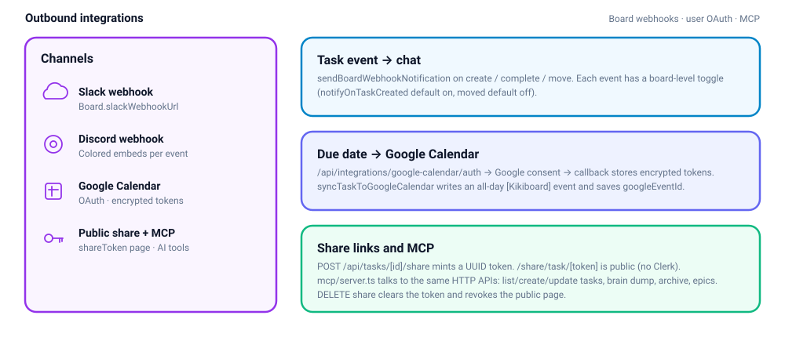

# Integrations

Boards can fan out to chat. Users can sync due dates to Google Calendar. Anyone with a share token can read a task without signing in. Agents can drive the HTTP API through MCP.

## Slack and Discord

Stored on the board (`slackWebhookUrl`, `discordWebhookUrl`) plus three flags:

| Flag | Default | Event |
|---|---|---|
| `notifyOnTaskCreated` | true | `task_created` |
| `notifyOnTaskCompleted` | true | `task_completed` |
| `notifyOnTaskMoved` | false | `task_moved` |

`sendBoardWebhookNotification` in `lib/notifications/webhooks.ts` loads those fields, bails if the flag is off, then POSTs Slack `blocks` and/or a Discord embed.

**Wired today:** `PATCH /api/tasks/updateTask/[taskId]` fires `task_completed` when `completed` flips to true. The dispatcher also understands created and moved, and the board UI can store those flags, but create/move handlers do not call it yet.

Admins configure URLs at `/api/boards/[boardId]/integrations`.

## Google Calendar

Per-user `UserCalendarSync` (encrypted access + refresh tokens).

1. `GET /api/integrations/google-calendar/auth` (signed in) redirects to Google OAuth (`calendar.events`, `access_type=offline`, `prompt=consent`). `state` is the Kikiboard user id.
2. Callback `/api/integrations/google-calendar/callback` is **public** in the Clerk matcher (Google redirects here). It exchanges the code and upserts tokens.
3. `syncTaskToGoogleCalendar` can create an all-day `[Kikiboard] {title}` event on the primary calendar and store `Task.googleEventId`. Expired access tokens are refreshed first.
4. **Dormant:** nothing in task create/update calls the sync helper, and Settings has no calendar tab that starts the OAuth flow. The in-app `/dashboard/calendar` is Neon due dates (`GET /api/calendar`), not Google.

## Public task share

`POST /api/tasks/[taskId]/share` — mint or reuse a UUID `shareToken`.

URL: `{APP_URL}/share/task/{token}` — listed as public in middleware. The page loads the task by token (labels, subtasks, epic, attachments, comments) and renders a read-only view.

`DELETE` sets `shareToken` to null and kills the link.

`GET` returns the current token/url for the share UI.

## Email

Invites are the Resend integration (`app/api/boards/[boardId]/invitations/route.ts`). See [Invitations](./invitations.md).

## MCP

See [AI](./ai.md#mcp) and `mcp/README.md`. The MCP process is a sidecar that talks HTTP to the Next app; it is not a Vercel route.
