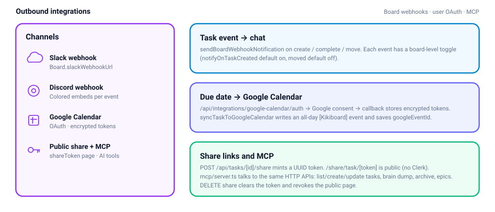

# Integrations

Boards can fan out to chat. Users can sync due dates to Google Calendar. Anyone with a share token can read a task without signing in. Agents can drive the HTTP API through MCP.

## Slack and Discord

Stored on the board (`slackWebhookUrl`, `discordWebhookUrl`) plus three flags:

| Flag | Default | Event |
|---|---|---|
| `notifyOnTaskCreated` | true | `task_created` |
| `notifyOnTaskCompleted` | true | `task_completed` |
| `notifyOnTaskMoved` | false | `task_moved` |

`sendBoardWebhookNotification` in `lib/notifications/webhooks.ts` loads those fields, bails if the flag is off, then POSTs Slack `blocks` and/or a Discord embed.

**Wired today:** `PATCH /api/tasks/updateTask/[taskId]` fires `task_completed` when `completed` flips to true. The dispatcher also understands created and moved, and the board UI can store those flags, but create/move handlers do not call it yet.

Admins configure URLs at `/api/boards/[boardId]/integrations`.

## Google Calendar

Per-user `UserCalendarSync` (encrypted access + refresh tokens).

1. `GET /api/integrations/google-calendar/auth` (signed in) redirects to Google OAuth (`calendar.events`, `access_type=offline`, `prompt=consent`). `state` is the Kikiboard user id.
2. Callback `/api/integrations/google-calendar/callback` is **public** in the Clerk matcher (Google redirects here). It exchanges the code and upserts tokens.
3. `syncTaskToGoogleCalendar` can create an all-day `[Kikiboard] {title}` event on the primary calendar and store `Task.googleEventId`. Expired access tokens are refreshed first.
4. **Dormant:** nothing in task create/update calls the sync helper, and Settings has no calendar tab that starts the OAuth flow. The in-app `/dashboard/calendar` is Neon due dates (`GET /api/calendar`), not Google.

## Public task share

`POST /api/tasks/[taskId]/share` — mint or reuse a UUID `shareToken`.

URL: `{APP_URL}/share/task/{token}` — listed as public in middleware. The page loads the task by token (labels, subtasks, epic, attachments, comments) and renders a read-only view.

`DELETE` sets `shareToken` to null and kills the link.

`GET` returns the current token/url for the share UI.

## Email

Invites are the Resend integration (`app/api/boards/[boardId]/invitations/route.ts`). See [Invitations](./invitations.md).

## MCP

See [AI](./ai.md#mcp) and `mcp/README.md`. The MCP server is the Streamable HTTP
route `/api/mcp`. Authentication does not use a browser session. Organization
owners and admins issue a credential for one organization. Board owners and
admins issue a credential for one board inside that organization. Tickets are
not filtered by environment. The same token cannot read a second organization.
Settings → MCP (`/dashboard/settings?tab=mcp`) creates either token and shows
it once in a selectable field. The board Integrations dialog creates the board
token. The route is public in Clerk middleware only because it performs this
machine authentication itself.

ChatGPT connects through the OAuth flow described in `mcp/README.md`. Settings
→ MCP includes ChatGPT instructions alongside the bearer configuration for other
clients. OAuth-created ChatGPT credentials appear in the same scope's token
list and use the existing revocation endpoints.

Settings → MCP now offers ChatGPT, Claude, Grok CLI/API and Gemini CLI guides.
ChatGPT clients are created per account in the app with an exact callback URL
and a one-time secret, eliminating deployment-secret setup for end users.

### MCP task writes and history

MCP read/write credentials support task creation, edits, moves, completion and
archiving within their organization/board scope. The creator must still have
board edit permission. Read-only credentials remain unchanged. OAuth write
access is approved explicitly during consent. Each operation stores before/after
state in `McpChange` and board activity in the same serializable transaction;
completion sends the existing board webhooks after commit. Settings → MCP
provides administrator-only history preview and confirmed revert, independently
of whether the original credential remains active. Reverts reject later edits
and missing original lists, and undo creation by archiving. Sent integration
messages are not recalled. See `mcp/README.md` for scope and supported fields.
