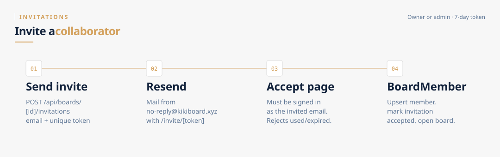

# Invitations

Owners and admins add people by email. The guest gets a 7-day token link, must sign in as **that same email**, then becomes a `BoardMember`.

## Send

`POST /api/boards/[boardId]/invitations` — `canManageBoard` (owner or admin).

1. Normalize email to lowercase.
2. Reject if that user is already a member, is the caller, or already has a **pending** invite on this board.
3. Insert `Invitation { email, token (cuid), status: "pending", expiresAt: now+7d }`.
4. Resend sends HTML mail from `no-reply@kikiboard.xyz` with `{APP_URL}/invite/{token}`.
5. If Resend fails, the handler returns 500 (“invitation created but email could not be sent”). The row may already exist — treat as a retry case.

`GET` on the same route lists owner, members, and (for managers) pending invitations.

Cancel: `DELETE /api/boards/[boardId]/invitations/[invitationId]` — **owner only** (admins can send invites but cannot revoke them).

The members UI currently shows the invite form only to the owner, even though admins are allowed to `POST`.

## Accept

Page: `/invite/[token]` (client).

1. `/invite/[token]` is **not** in the public matcher, so Clerk sends signed-out visitors to sign-in before the page loads. `GET /api/invite/[token]` also requires a session; it does not require the invited email.
2. The accept button still has a client-side `/sign-in?redirect_url=/invite/{token}` fallback. Clerk’s sign-in widget uses `forceRedirectUrl="/dashboard"`, so after login the user may land on the dashboard instead of the invite.
3. `POST /api/invite/[token]` then:

   | Check | Status |
   |---|---|
   | No session / no User | 401 |
   | Unknown token | 404 |
   | `status !== "pending"` | 409 already used |
   | `expiresAt < now` | 410 expired |
   | Signed-in email ≠ invitation email | 403 |
   | Caller is the board owner | 409 |

4. Transaction: `BoardMember` upsert (default role `member`) + invitation `status: "accepted"`.
5. Client navigates to `/board/{boardId}`.

There is no invite-time role picker in this flow: new members always start as `member`. An admin later patches `BoardMember.role`.
