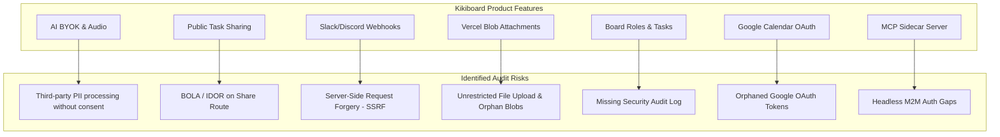
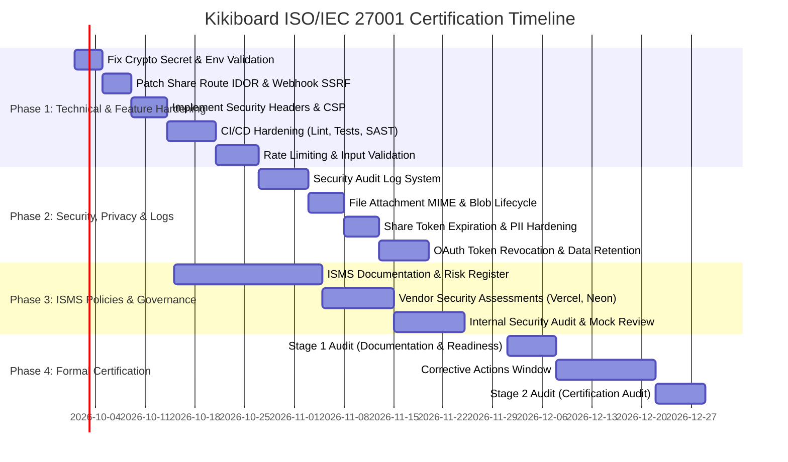

# ISO/IEC 27001 Compliance & Certification Project Plan

> **Scope**: Technical Gap Analysis, Feature-by-Feature Audit, Control Implementation Roadmap, and Project Plan for Kikiboard (`management-tool-v2`) to achieve ISO/IEC 27001:2022 (ISMS) and ISO/IEC 27018 / 27701 (Cloud Data Privacy) certification readiness.

---

## 1. Executive Summary & Reality of Certification

ISO certification is **not awarded directly to a Git repository or isolated software build**. Instead, an accredited certification body (e.g., BSI, TÜV, Schellman, A-LIGN) audits the **operating organization, its documented processes (ISMS), infrastructure providers, and operational practices**.

However, the **codebase, data model, CI/CD pipeline, and cloud architecture** represent the technical core tested under **ISO/IEC 27001:2022 Annex A controls**. If the repository contains security anti-patterns (such as hardcoded encryption fallbacks, missing automated tests in CI, unvalidated inputs, or absent security headers), an auditor will issue **Major Non-Conformities (MNCs)**, blocking certification.

This document outlines:
1. **Repository Baseline**: Global strengths and general non-conformities.
2. **Feature-by-Feature Audit**: In-depth analysis of Kikiboard's specific features against ISO controls.
3. **Project Plan & Roadmap**: Phased execution plan to achieve audit readiness.
4. **Developer Checklist**: Practical rules for engineers contributing to the codebase.

---

## 2. Global Repository Baseline: What We Have vs. What We Don't

### 2.1 What We Have (Current Strengths)

| Area | Current Implementation | ISO 27001 Control Ref | Status |
|---|---|---|---|
| **Authentication & Identity** | Managed via Clerk (`clerkMiddleware`, MFA support, session revocation, secure password hashing offloaded to SOC2/ISO compliant provider). | A.5.15, A.8.5 | ✅ Strong |
| **Webhook Security** | Clerk webhook endpoints verify cryptographic signatures with Svix (`POST /api/webhooks/clerk`). | A.8.20, A.8.24 | ✅ Strong |
| **RBAC & Authorization** | Board-level access control (`owner`, `admin`, `member`) implemented in `lib/boardRoles.ts` and verified in `lib/boardAccess.ts`. | A.5.15, A.8.2 | ✅ Adequate |
| **Resource Enumeration Defense** | API routes return `404 Not Found` rather than `403 Forbidden` when access checks fail, preventing unauthorized tenant enumeration. | A.8.26 | ✅ Good Practice |
| **Field-Level Encryption** | AES-256-GCM encryption implemented in `lib/crypto.ts` for AI API keys and Google OAuth tokens. | A.8.24 | ⚠️ Partially Implemented |
| **Multi-Tenant Isolation** | Database rows are strictly partitioned by `userId` and `boardId` in PostgreSQL schema. | A.8.22, A.8.26 | ✅ Adequate |
| **Public Link Revocation** | Public task links use high-entropy UUIDs (`shareToken`) and can be explicitly revoked via `DELETE /api/tasks/[taskId]/share`. | A.8.20 | ✅ Adequate |
| **File Storage Isolation** | File attachments utilize Vercel Blob configured with private access. | A.8.23 | ✅ Adequate |
| **Prisma Migration Safety** | GitHub Actions verifies that `schema.prisma` matches applied migrations before deployment. | A.8.31, A.8.32 | ✅ Strong |

---

### 2.2 Global Gaps & Repository-Wide Non-Conformities

The following items are immediate blockers across the repository:

#### 🚨 Critical / Major Non-Conformities (Must Fix Immediately)
1. **Hardcoded Fallback Cryptographic Secret (`lib/crypto.ts`)**:
   ```typescript
   // lib/crypto.ts:11
   const secret = process.env.ENCRYPTION_SECRET || process.env.CLERK_SECRET_KEY || "kikiboard-fallback-secret-key-32-chars-min!!";
   ```
   * **Audit Risk**: If `ENCRYPTION_SECRET` is omitted in an environment, production data is encrypted with a publicly accessible key. In an ISO 27001 audit (Control A.8.24 *Use of Cryptography*), this is an automatic **Major Non-Conformity**.
   * **Remediation**: Remove the hardcoded fallback; throw a fatal startup error if `ENCRYPTION_SECRET` is not set or has insufficient entropy.

2. **CI/CD Quality & Security Gates Bypassed (`.github/workflows/ci.yml`)**:
   * **Linting disabled**: `pnpm lint` has `continue-on-error: true` because of 47 legacy errors.
   * **Unit tests omitted**: `vitest run` is completely missing from `.github/workflows/ci.yml`.
   * **Audit Risk**: Violates Control A.8.25 (*Secure Development Life Cycle*) and A.8.32 (*Change Management*). Code that fails tests or static analysis can be deployed to production.

3. **Missing Automated Vulnerability Scanning (SAST & SCA)**:
   * No automated dependency vulnerability check (`pnpm audit`, Snyk, Trivy, or Dependabot).
   * No static application security testing (CodeQL, SonarQube, or Semgrep).
   * **Audit Risk**: Violates Control A.8.8 (*Management of Technical Vulnerabilities*).

4. **Missing HTTP Security Headers & Content Security Policy (CSP)**:
   * Neither `next.config.ts` nor `middleware.ts` sets `Content-Security-Policy`, `Strict-Transport-Security` (HSTS), `X-Frame-Options`, `X-Content-Type-Options`, `Referrer-Policy`, or `Permissions-Policy`.
   * **Audit Risk**: High vulnerability to Clickjacking, XSS, and MIME-sniffing. Violates Control A.8.26 (*Application Security Requirements*).

5. **Lack of Rate Limiting & DoS Protection**:
   * API endpoints (`/api/tasks/*`, `/api/boards/*`, `/api/search`) have zero rate limiting.
   * Public routes (`/share/task/[token]`, `/api/integrations/google-calendar/callback`) can be brute-forced or spammed.
   * **Remediation**: Integrate edge rate-limiting (e.g. `@upstash/ratelimit` or Next.js edge middleware token bucket). Violates Control A.8.20 (*Network Security*).

---

## 3. Feature-by-Feature ISO Compliance Matrix & Vulnerability Analysis

This section analyzes each product feature in Kikiboard against ISO/IEC 27001 Annex A, ISO/IEC 27018 (Cloud PII Protection), and ISO/IEC 27701 (Privacy).



---

### 3.1 AI Features (BYOK, Voice Audio Transcription, Brain Dump, Card Improver)

* **Architecture**: Users provide personal API keys (`UserSettings.aiApiKey`) for OpenAI, Anthropic, Gemini, Grok, DeepSeek, Kimi, or custom endpoints. Backend routes (`/api/ai/transcribe`, `/api/ai/parse`, `/api/ai/improve`) decrypt the key and proxy requests.
* **ISO Control Ref**: A.5.19 (*Supplier Relationships*), A.8.24 (*Cryptography*), ISO 27018 (*Processing PII in Cloud*).

| Aspect | Current Status | Audit Finding & Gap | Required Remediation |
|---|---|---|---|
| **Key Storage** | AES-256-GCM in `lib/crypto.ts` | Fallback secret in code invalidates encryption guarantee. | Remove fallback; require strictly managed 32-byte secret. |
| **Data Processing & PII** | Audio files & prompts proxied through backend | Voice audio and board contents pass to 3rd-party LLMs without documented user consent. | Add explicit AI Processing Terms/Notice in `/dashboard/settings` clarifying third-party transmission. |
| **Error Handling & Logs** | Runtime error catches | External API errors may dump prompt text or partial headers to server logs. | Scrub LLM API error objects before logging to stdout/monitoring. |
| **Data Retention** | Ephemeral multipart handling | Transcribed audio files are memory/temp-handled without permanent storage. | Formalize and document ephemeral processing policy in ISMS scope. |

---

### 3.2 Public Task Sharing (`/share/task/[token]`)

* **Architecture**: Generates a UUID `shareToken` so unauthenticated parties can view a read-only task page (`/share/task/[token]`) with subtasks, comments, labels, and attachments.
* **ISO Control Ref**: A.8.2 (*Privileged Access*), A.8.20 (*Network Security*), A.8.26 (*Application Security*), ISO 27018.

| Aspect | Current Status | Audit Finding & Gap | Required Remediation |
|---|---|---|---|
| **Access Authorization** | Session authenticated in `app/api/tasks/[taskId]/share/route.ts` | **🚨 Critical BOLA / IDOR**: `GET`, `POST`, and `DELETE` check Clerk sign-in but **never verify `hasBoardAccess`**. Any authenticated user can generate, view, or delete share tokens for ANY task in the system. | Enforce `hasBoardAccess(user.id, task.list.boardId)` in `GET`, `POST`, and `DELETE` before returning or mutating tokens. |
| **Token Lifecycle** | Indefinite UUID token | Tokens never expire (`expiresAt` is absent). No rate limiting on public viewing. | Add optional `expiresAt DateTime?` and view counters. Apply IP rate limiting on `/share/task/[token]`. |
| **Content Scoping** | Returns all task relations | Exposes comments and attachments publicly without granular exclusion toggles. | Provide toggle to exclude internal comments/attachments from public shares. |

---

### 3.3 Outbound Webhooks (Slack & Discord)

* **Architecture**: Admins set `slackWebhookUrl` and `discordWebhookUrl` on the `Board` model. The backend dispatches task created, moved, and completed events via HTTP POST in `lib/notifications/webhooks.ts`.
* **ISO Control Ref**: A.8.20 (*Network Security*), A.8.26 (*Application Security Requirements*).

| Aspect | Current Status | Audit Finding & Gap | Required Remediation |
|---|---|---|---|
| **Configuration Permissions** | Restricted to `owner` and `admin` in `integrations/route.ts` | Properly checks `isBoardAdmin`. | Maintain strict role checks. |
| **URL Validation** | Raw string storage in DB | **🚨 High SSRF Risk**: No hostname validation. Attackers can supply `http://169.254.169.254` (cloud metadata) or internal RFC1918 IPs, forcing the server to make internal requests. | Validate that URLs strictly match `^https://hooks\.slack\.com/` or `^https://(?:discord\.com|discordapp\.com)/api/webhooks/`. Reject all loopback/private IPs. |
| **Event Reliability** | Fire-and-forget fetch | Delivery failures only log to `console.error` without dead-letter audit. | Log failed webhook attempts to the board activity/audit feed. |

---

### 3.4 File Attachments (Vercel Blob Storage)

* **Architecture**: Attachments are uploaded to Vercel Blob with `access: "private"` and downloaded via `/api/tasks/[taskId]/attachments/[attachmentId]/download`.
* **ISO Control Ref**: A.8.7 (*Protection Against Malware*), A.8.23 (*Information Access Restriction*), ISO 27701.

| Aspect | Current Status | Audit Finding & Gap | Required Remediation |
|---|---|---|---|
| **Download Authorization** | Protected route | Properly checks `hasBoardAccess(user.id, board.id)`. | Maintain this check. |
| **Malware & MIME Control** | Direct upload acceptance | Accepts arbitrary file types without extension allowlisting, MIME verification, or virus scanning. | Restrict uploaded file types (reject executables `.exe`, `.bat`, `.sh`, `.cmd`); enforce file size limits (max 15MB). |
| **Data Lifecycle / Cleanup** | Cascade deletes in Prisma | Deleting a task or board deletes database rows, but **leaves orphaned files stored in Vercel Blob**. | Trigger `@vercel/blob` `del()` when tasks or attachments are deleted. |

---

### 3.5 Collaboration, Board Roles & Security Audit Logging

* **Architecture**: Board roles (`owner`, `admin`, `member`) govern access. Activity logs track task lifecycle.
* **ISO Control Ref**: A.5.15 (*Access Control*), A.8.15 (*Logging*), A.8.16 (*Monitoring*).

| Aspect | Current Status | Audit Finding & Gap | Required Remediation |
|---|---|---|---|
| **Role Assignment Enforcement** | Dedicated routes verify `memberCanAssign` | `PATCH /api/tasks/updateTask/[taskId]` updates `assigneeId` and `qaId` **without checking `memberCanAssign`**, bypassing the board restriction. | Enforce `memberCanAssign` check inside `updateTask` when assignee/QA fields are present. |
| **Audit Logging Scope** | `ActivityLog` tracks business events | No security audit log exists for: user privilege elevations, board member additions/removals, API key updates, or board deletions. | Implement a dedicated `SecurityAuditLog` table capturing actor, target, action, IP address, and timestamp. |
| **Data Erasure Compliance** | `onDelete: Cascade` on models | Immediate physical deletion prevents recovery from accidental or malicious deletions and leaves no audit trail. | Implement soft-delete (`deletedAt`) with a 30-day retention window before permanent purge. |

---

### 3.6 Google Calendar OAuth Integration

* **Architecture**: OAuth 2.0 flow (`/api/integrations/google-calendar/*`) requests offline access to Google Calendar; stores encrypted tokens in `UserCalendarSync`.
* **ISO Control Ref**: A.8.24 (*Key Management*), ISO 27018 (*PII Management*).

| Aspect | Current Status | Audit Finding & Gap | Required Remediation |
|---|---|---|---|
| **Token Encryption** | Encrypted using AES-256-GCM | Strong cipher, but affected by the fallback key risk in `lib/crypto.ts`. | Fixed by Phase 1 secret management hardening. |
| **Account Deletion Revocation** | Clerk webhook deletes DB row via Cascade | **Orphaned OAuth Token**: Deleting a user in Clerk deletes the database row, but does not revoke the token at Google's OAuth endpoint. | Dispatch a token revocation request to `https://oauth2.googleapis.com/revoke` upon user deletion or disconnection. |
| **Scope Minimization** | `calendar.events` scope | Minimal scope requested. | Maintain least-privilege scope. |

---

### 3.7 MCP (Model Context Protocol) Sidecar Server

* **Architecture**: Independent TypeScript server (`mcp/server.ts`) exposing board tools to local AI assistants (Claude Desktop, Cursor).
* **ISO Control Ref**: A.8.5 (*Secure Authentication*), A.8.26 (*Application Security*).

| Aspect | Current Status | Audit Finding & Gap | Required Remediation |
|---|---|---|---|
| **Authentication Model** | HTTP calls without session management | Cannot authenticate with production Clerk-protected routes without manual cookie injection (`docs/ai.md:59`). | Implement hashed Personal Access Tokens (PATs) or API keys for programmatic/headless MCP access. |
| **Route Alignment** | Calls `/api/tasks` directly | Route does not exist in the Next.js API, causing 404s. | Implement the missing scoped endpoints or align MCP tool definitions. |

---

## 4. Project Plan: Path to ISO Certification



### Phase 1: Technical & Feature Hardening (Weeks 1–3)

* **Goal**: Fix all critical vulnerabilities, code-level flaws, and CI/CD blockers.
* **Deliverables**:
  1. **Secret & Key Management**:
     * Remove the fallback string in `lib/crypto.ts:11`.
     * Add runtime environment validation (Zod / `@t3-oss/env-nextjs`) on startup.
  2. **Authorization & SSRF Fixes**:
     * Add `hasBoardAccess` checks in `app/api/tasks/[taskId]/share/route.ts` (`GET`, `POST`, `DELETE`).
     * Enforce strict domain allowlist (`hooks.slack.com`, `discord.com/api/webhooks`) in `app/api/boards/[boardId]/integrations/route.ts`.
     * Check `memberCanAssign` in `PATCH /api/tasks/updateTask/[taskId]`.
  3. **Security Headers**:
     * Configure `next.config.ts` headers: `Content-Security-Policy`, `Strict-Transport-Security`, `X-Frame-Options: DENY`, `X-Content-Type-Options: nosniff`, `Referrer-Policy`, `Permissions-Policy`.
  4. **CI/CD Security Pipeline**:
     * Fix the 47 legacy ESLint errors; remove `continue-on-error: true`.
     * Add `pnpm test` (Vitest) step to `.github/workflows/ci.yml`.
     * Add `pnpm audit --audit-level=high` to CI.
     * Configure GitHub CodeQL and Dependabot.
  5. **Rate Limiting**:
     * Implement token-bucket rate limiting on `/api/*` and public share routes.

---

### Phase 2: Security, Privacy & Logging (Weeks 3–5)

* **Goal**: Implement audit trails, data protection, and privacy mechanisms required by ISO 27001 Annex A.8 and ISO 27018.
* **Deliverables**:
  1. **Security Event Logging (`SecurityAuditLog`)**:
     * Create a dedicated model for immutable security events:
       * Member invitations, role changes, board deletions.
       * Secret rotations, AI key modifications.
       * Failed authorization attempts.
     * Store: timestamp (UTC), actorId, action, targetResource, IP, user-agent.
  2. **File & Attachment Lifecycle**:
     * Add file type extension/MIME allowlist and 15MB file size limit to attachment upload route.
     * Call `@vercel/blob` `del()` when tasks or attachments are deleted.
  3. **Privacy & Public Share Controls**:
     * Add `expiresAt DateTime?` and optional password/PIN protection to `Task.shareToken`.
     * Add AI Data Processing Consent disclosure on `/dashboard/settings`.
  4. **Token Revocation & Data Retention**:
     * Call Google OAuth token revocation endpoint when disconnecting calendar sync or deleting a user.
     * Implement soft-deletes (`deletedAt`) with a 30-day retention window.

---

### Phase 3: ISMS Policies, Vendor Management & Operations (Weeks 5–8)

* **Goal**: Establish the organizational and administrative policies that auditors will examine alongside the code.
* **Deliverables**:
  1. **Repo Security Documentation**:
     * Add `SECURITY.md` defining vulnerability disclosure policy and security contact.
     * Document SDLC practices in `docs/sdlc-security.md`.
  2. **Formal ISMS Policies**:
     * Information Security Policy (A.5.1).
     * Access Control & Least Privilege Policy (A.5.15).
     * Cryptographic & Key Management Policy (A.8.24).
     * Incident Management & Response Plan (A.5.24 - A.5.28).
     * Business Continuity & Disaster Recovery Plan (A.5.29 - A.5.30).
  3. **Vendor Security Due Diligence (A.5.19 - A.5.22)**:
     * Collect and review SOC 2 / ISO 27001 certificates for:
       * **Vercel** (Hosting, Edge, Blob)
       * **Neon** (PostgreSQL Database)
       * **Clerk** (Authentication & Identity)
       * **Resend** (Transactional Email)
       * **Google Cloud** (Calendar Integration)
  4. **Access Governance**:
     * Enforce MFA and SSO across GitHub, Vercel, Neon, Clerk, and domain registrar accounts.
     * Implement GitHub branch protection rules on `main` and `dev` (mandatory peer review, linear history, signed commits).

---

### Phase 4: Internal Audit & External Certification (Weeks 9–12)

* **Goal**: Undergo formal auditing and obtain the ISO/IEC 27001:2022 certificate.
* **Steps**:
  1. **Risk Assessment & Statement of Applicability (SoA)**:
     * Document all in-scope assets, threats, vulnerabilities, and the 93 Annex A controls.
  2. **Internal Audit**:
     * Perform an internal audit (conducted by an independent team member or external consultant) to identify non-conformities before the registrar arrives.
  3. **Stage 1 Audit (Document Review)**:
     * Certification body reviews ISMS documentation, scope, policies, and SoA.
  4. **Stage 2 Audit (Implementation Testing)**:
     * Auditor conducts live walkthroughs of the GitHub repository, CI/CD pipeline, AWS/Vercel/Neon configurations, and access management.
  5. **Certification Issuance**:
     * Auditor issues formal recommendation; ISO/IEC 27001 certificate is awarded (valid for 3 years, subject to annual surveillance audits).

---

## 5. Technical Control Checklist for Developers

Engineers working in this repository should verify compliance using this checklist:

- [ ] **No Hardcoded Secrets**: Secrets are read from environment variables; application refuses to start if missing.
- [ ] **No Unchecked Task Access (BOLA/IDOR)**: Always verify `hasBoardAccess` before returning or mutating tasks, attachments, or share links.
- [ ] **Webhook Target Validation**: All outbound webhook URLs are verified against allowed domain patterns (`hooks.slack.com`, `discord.com/api/webhooks`).
- [ ] **Upload Protection**: File uploads enforce MIME/extension allowlists and size limits (max 15MB).
- [ ] **Dependency Hygiene**: No critical/high vulnerabilities in `pnpm-lock.yaml` (`pnpm audit`).
- [ ] **All PRs Pass CI**: Tests (`vitest run`), linter (`eslint`), and TypeScript check (`tsc --noEmit`) pass with zero errors.
- [ ] **Input Sanitization**: Every API endpoint parses inputs with Zod schemas.
- [ ] **Safe Logging**: `console.log` and logger utilities never print plaintext tokens, passwords, or PII.
- [ ] **Encrypted Storage**: Sensitive credentials (e.g. API keys) are encrypted with AES-256-GCM before writing to the database.
- [ ] **Code Reviews**: Every production change is reviewed by at least one peer via GitHub Pull Request.
