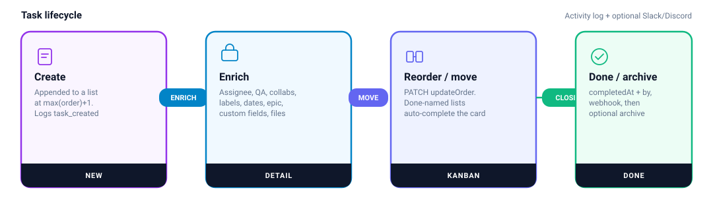

# Tasks

A task lives on a list. Members with board access can create, edit, move, comment, and attach files. Completing and archiving are first-class states.

## Create

`POST /api/tasks/createTask` `{ title, listId }`

1. List must exist and the caller must `hasBoardAccess` on its board.
2. `order = lastTask.order + 1` (or 0).
3. Activity `task_created`.

Bulk (AI brain dump, MCP): `POST /api/boards/[boardId]/batchTasks` creates many cards with optional description, priority, dates, quarter, epic, and nested subtasks, then logs `activity.brainDump`.

## Update

`PATCH /api/tasks/updateTask/[taskId]`

Writable fields: title, description, completed, startDate, dueDate, priority, epicId, quarter, archived, assigneeId, qaId, listId.

This handler does **not** re-check `memberCanAssign` when `assigneeId` / `qaId` are sent here. The dedicated assign/QA routes do.

**Done-list shortcut:** if the card is moved to a list whose title matches `isDoneList` (`done` / `hecho` / `completad` / `finaliz`) and `completed` was not sent, the API sets `completed`, `completedAt`, and `completedById`. Moving out of a done list reopens it.

Activity types from this handler: `task_moved`, `task_completed` / `task_reopened`, `task_renamed`. Completing also calls `sendBoardWebhookNotification({ eventType: "task_completed" })`.

## Reorder (Kanban)

`PATCH /api/tasks/updateOrder`

Body: `{ items: [{ id, order, listId }], movedTaskId, fromListId, toListId }`.

All tasks and lists must belong to **one** board (cross-board updates 400). On a list change it logs `task_moved`. This path does **not** auto-complete from the list title — that happens on `updateTask`.

## Delete

`DELETE /api/tasks/deleteTask/[taskId]` — access + activity.

## Enrichment APIs

| Concern | Route |
|---|---|
| Assignee | `POST /api/tasks/[taskId]/assignee` (and `assignees`) |
| QA | `POST /api/tasks/[taskId]/qa` |
| Collaborators | `/api/tasks/[taskId]/collaborators` |
| Labels | `/api/tasks/[taskId]/labels` |
| Subtasks | `/api/tasks/[taskId]/subtasks` |
| Comments | `/api/tasks/[taskId]/comments` |
| Custom field values | `/api/tasks/[taskId]/custom-values` |
| Attachments | `POST /api/tasks/[taskId]/attachments` → Vercel Blob `attachments/{taskId}/{name}` |
| Share link | `/api/tasks/[taskId]/share` (session required; **no** `hasBoardAccess` check) |

Priority values used in the UI: Urgent, High, Medium, Low.

Subtasks are a checklist (`completed` + `order`). The card shows `completed/total`.

Attachments are private blobs. Download goes through `/api/tasks/[taskId]/attachments/[attachmentId]/download`.

## Archive and epics

`archived` / `archivedAt` hide work from the active board. `/api/boards/[boardId]/archive` lists archived cards. Epics group tasks (`Epic.status` open/completed, optional `quarter` like `2026-Q1`). Tasks can also store their own `quarter`.

## Dashboard and calendar reads

- Dashboard aggregates pending, overdue, completed-this-week, assigned-to-me.
- `/api/calendar` feeds the month view with due-dated tasks.
- Cmd+K hits `/api/search`.
